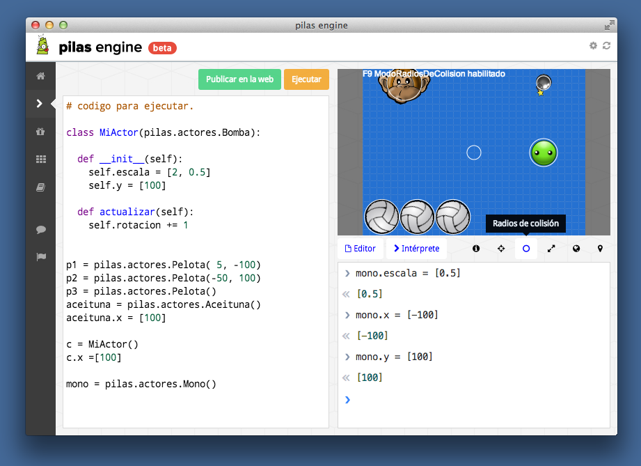

## Pilas web engine 

### ¿Qué es pilas-engine web?

pilas-engine web es una biblioteca para realizar videojuegos de manera
sencilla orientada a estudiantes.

Es la versión hermana de pilas-engine (versión python: www.pilas-engine.com.ar)
pero orientada a la web, utilizando HTML5 y typescript.

Puedes conocer mas sobre pilas web en: http://pilas-editor.com.ar/

### Instalar dependencias en Ubuntu

Este proyecto utiliza node.js y npm. Así que el primer paso es
asegurarnos de instalar nodejs con los siguientes comandos:

    sudo apt-get install python-software-properties python g++ make
    sudo add-apt-repository ppa:chris-lea/node.js
    sudo apt-get update
    sudo apt-get install nodejs

A partir de ahí, deberías tener instalado los comandos nodejs
y npm para continuar con el paso siguiente:

### Generar

Este repositorio utiliza grunt y tiene todo lo necesario para compilar
y generar una versión distribuible de pilas-engine web.

Estos son los pasos para ejecutar las demostraciones:

1. Ejecuta el comando `npm install`.
2. Ejecuta `grunt` o `./node_modules/grunt-cli/bin/grunt` para generar la versión javascript distribuible.
3. Abre el archivo dist/index.html para ver las demos.

Opcionalmente, si estás desarrollando, podrías ejecutar `grunt watch` para
habilitar la compilación continua. Y si `grunt` no te funciona como
comando podrías agregarlo al path de sistema así:

     export PATH=PATH:./node_modules/-cli/bin

### Aplicación desktop

Pilas incluye una versión experimental de aplicación desktop.

Para instalarla hacen falta unas dependencias adicionales:

    npm install
    sudo npm install -g bower
    cd ide
    bower install
    npm install
    cd ..

    make test         # o 'make test_mac'

Luego, si quieres generar las versiones compiladas para todas
las plataformas tienes que ejecutar:

    make build

el comando 'make' sin argumentos te muestra varias opciones
disponibles.
